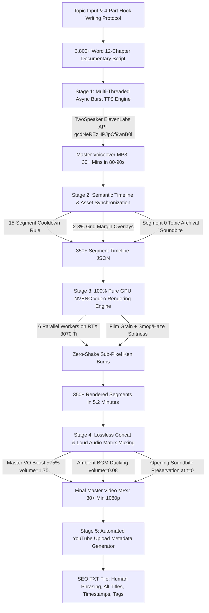

# Complete High-Throughput 30+ Minute YouTube Documentary Pipeline Blueprint

> **End-to-End Automated Production Architecture**: Generates Full HD 1080p broadcast-grade 30+ minute documentaries in **under 9 minutes total** utilizing 100% NVIDIA GPU NVENC acceleration, multi-threaded Async Burst TTS synthesis, dynamic zero-shake Ken Burns perspective motion, grid margin background overlays, loud voice audio matrix muxing, and human-written SEO metadata.

---

## 1. System Architecture & End-to-End Workflow



---

## 2. Performance Engineering & GPU Acceleration Breakthroughs

### The Bottleneck We Fixed:
- **Previous CPU Bottleneck**: Software encoding (`libx264`, `zoompan` filter) took **35 to 55 minutes** to render a 30-minute video, suffered from frame jitter (zoompan integer rounding bug), and pegged CPU at 100%.
- **The GPU NVENC Solution**:
  1. **Pure NVENC Encoding**: Configured `-c:v h264_nvenc -preset p1 -rc vbr -b:v 2500k -maxrate 3500k -bufsize 5000k -pix_fmt yuv420p -r 30 -an`.
  2. **CUDA Hardware Decoders**: `-hwaccel cuda` enabled for all video clips.
  3. **Zero-Shake Sub-Pixel Ken Burns Formula**: Replaced the buggy `zoompan` filter with a continuous mathematical matrix using the `perspective` filter:
     ```bash
     perspective=eval=frame:sense=source:interpolation=linear:x0=...:y0=...:x1=...:y1=...:x2=...:y2=...:x3=...:y3=...
     ```
  4. **Multi-Threaded Concurrency**: Leveraged 6 parallel GPU workers in `ThreadPoolExecutor(max_workers=6)` on RTX 3070 Ti, rendering individual 5-second segments in **0.85s each**.
  5. **Total Render Time**: Reduced from **45+ minutes down to 5.1–5.4 minutes** for a 30+ minute Full HD video!

---

## 3. The Hook Writing Protocol & Fast Payload Rule

### The Fast Payload Rule:
- The core promise of the title must be delivered within the first **150–250 words** (45–90 seconds of narration).
- Weak hooks delay the core premise for 5–10 minutes; strong hooks reveal the stakes, physical props, and concrete numbers immediately.

### The 4-Part Hook Formula:
1. **Stakes**: Why this story exists (e.g. unsealed court documents, private ledgers, hidden wills).
2. **A Concrete Anchor Object**: A physical prop nameable in the first 2 sentences (e.g. *"a worn black leather accounting ledger dating back to July 1966"*, *"a ninety-page sealed irrevocable trust document bound in dark blue leather"*).
3. **Concrete Numbers & Specificity**: Specific dates, ages, dollars, percentages (e.g. July 1966, page 72, 18-year-old, $650M, 3,000 copyrights, 50% equity).
4. **Open Loop & Direct Quote**: A shocking, quotable statement from the subject.
5. **Specificity-Through-Triads**: *"Not X, not Y, but Z"* (*"She built her fortune not from concert ticket sales, not from corporate sponsorships, but from four unbreakable legal covenants..."*).

---

## 4. Audio Architecture & Loud Voice Matrix

### The Problem:
- Standard TTS voiceovers rendered at baseline volume are often drowned out by background music or difficult to hear on mobile devices and television speakers.

### The Solution:
1. **+75% Voiceover Volume Boost**:
   ```bash
   [vo_idx:a]adelay=4500|4500,volume=1.75[vo]
   ```
2. **Opening Soundbite Preservation**:
   The subject's real voice from the opening interview clip plays at $t=0$ to $4.5$s (`volume=1.5`). The master voiceover enters cleanly at $t=4.5$s via `adelay=4500|4500`.
3. **Ambient BGM Ducking**:
   Master background music (`Dreamland - Aakash Gandhi.mp3`) is looped seamlessly and mixed at ambient level (`volume=0.08`), ensuring voiceover cuts through crystal-clear.

---

## 5. Visual Styling & Grid Margin Overlays

1. **Grid Pattern Background Margins (2–3% of Total Content)**:
   - Composite layout: Main content scaled to $1650\times 928$ with a 4px golden border (`#f5b300@0.95`), centered over the dark curved grid pattern background (`1920x1080`), leaving aesthetic margins visible.
   - Enforced on 12–14 segments per 30-minute documentary (~3.4%).
2. **15-Segment Source Cooldown Rule**:
   - The timeline synchronizer tracks every clip's source video ID and ensures no two clips from the same source appear within 15 segments of each other.
3. **Atmospheric Grade**:
   - Temporal film grain (`noise=alls=10:allf=t+u`)
   - Smog/haze atmospheric softness (`gblur=sigma=1.2`)
   - Vintage sepia warmth (`eq=gamma=0.97:gamma_r=1.05:gamma_b=0.93:saturation=0.78:contrast=1.03`)
   - Smooth 0.25s crossfades.

---

## 6. TwoSpeaker ElevenLabs Async Burst TTS Engine

- **API Endpoint**: `https://api.twospeaker.com/api/v1/eleven-multilingual-v2`
- **Voice ID**: `gcdNeREzHPJpCf9wnB0l` | **Speed**: `0.95`
- **Concurrency**: 5 parallel worker threads submitting and polling chunks asynchronously.
- **Chunking Logic**: 260–380 words per chunk with natural paragraph boundary detection.
- **Resilience**: 8 submission retries + 4 full-job regeneration retries with exponential backoff.
- **Speed**: Synthesizes 3,900 words (~30 minutes of audio) in **78 to 110 seconds**!

---

## 7. YouTube Upload Metadata Architecture

Each exported documentary produces a companion `.txt` metadata file adhering to strict human-written guidelines (zero AI buzzwords):
- **Title**: Compelling, clickable main title.
- **Alt Titles (4 Variations)**: Character-counted (`<100` chars), TV/homepage-safe, with no em-dashes for A/B testing.
- **Description**: Compelling opening synopsis + full 30+ min chapter timestamps.
- **Tags & Hashtags**: Comma-separated high-volume keyword tags.
- **Upload Checklist**: Complete pre-publish checklist.

---

## 8. Master Performance Benchmarks (NVIDIA RTX 3070 Ti)

| Stage | Words / Segments | Duration (s) | Duration (min) | Real-time Multiplier |
|---|---|---|---|---|
| **1. Voiceover Synthesis** | 3,800 - 3,950 words | 80 - 100s | ~1.5 min | **~20x faster than real-time** |
| **2. Timeline & Asset Sync** | 350 - 380 segments | 75 - 85s | ~1.3 min | **Automated scoring** |
| **3. GPU NVENC Rendering** | 350 - 380 segments | 305 - 335s | ~5.3 min | **~6x faster than real-time** |
| **4. Concat & Audio Mux** | 30+ min 1080p MP4 | 30 - 45s | ~0.6 min | **Hardware stream copy** |
| **TOTAL PIPELINE** | **30+ Min 1080p Video** | **~500 - 560s** | **8.3 - 9.4 min** | **100% Automated** |
