# Documentary Templates: styles, scenes and a starter project

This is the reusable kit behind three faceless investigative documentaries:

| Video | Style | Theme · grade · grain | Signature devices |
|---|---|---|---|
| *Noah's Ark Confirmed After 4,300 Years? What We Actually Know* | **Paper / Vox explainer** | `paper` · `doc` · 5 | Paper tabletop collages, three case folders (known / claimed / unknown), newspaper page, ledger arithmetic |
| *Noah's Ark "100% Confirmed"? Here's What Researchers Actually Found* | **Forensic lab report** | `forensic` · `cool` · 2 | Observed / Claimed / Confirmed filter, ring gauge 100 % → 0 %, x-ray scans, one-source network |
| *Myth or Reality? Hunting for the REAL Noah's Ark* | **Expedition & courtroom** | `expedition` · `warmsepia` · 2 | Field journal and antique map, evidence tags EXHIBIT A–D, scales of justice, split-flap scoreboard, REALITY / MYTH verdict |
| *How Do Hasidic Jews Afford 10 Kids Without Jobs* | **Calm documentary** | `documentary` · `doc` · 1.5 + dissolves | Slow photographs, soft dissolves, serif chapter headings, location captions, a household ledger that grows one layer per chapter, gentle bar charts, a household-size chart, maps |
| *BREAKING: They Drilled Into Noah's Ark — Then the Drill Bit Shattered* | **Breaking-news broadcast** | `broadcast` · `broadcast` · 1.5 | LIVE bug and crawling ticker, BREAKING NEWS slab, borehole cross-section where the bit shatters, fact-check meters, headline wall → one source, OBSERVED / CLAIMED board, numbered segment bumpers |

Everything here is plain files you can copy into any project:

```
docu/                       the engine (keep the folder together)
├── engine.html, engine.js  the page and core helpers (easing, fonts, themes, overlays)
├── scenes_photo.js         photo, depth, spotlight, tv, card, split
├── scenes_paper.js         collage (+ all collage items), newspaper, headlines, baskets, chapter
├── scenes_data.js          title, stat, quote, words, ledger, timeline, measure, checklist, geo
├── scenes_map.js           map (orthographic globe → province)
├── scenes_lab.js           filter, gauge, network, valley, cells, scan item
├── scenes_court.js         scales, scoreboard, verdict, tag item
├── scenes_doc.js           doctitle, textcard, bars, ledgerlist, sizechart + overlays place, doclower
├── scenes_news.js          breaking, borehole, factcheck, echo, columns, videowall, newslist, segment
│                           + overlays ticker, bug, newslower
├── timing.py               script phrases → voiceover word times
├── prep.py                 grades, blur/dim variants, rembg cut-outs, paper surfaces
├── render.py               headless Chromium frames / FFmpeg clips → one MP4 per scene
├── mix.py                  synthesised SFX, music beds, ducking, loudness
├── edl.py                  the shot helpers and the build commands
└── templates/              ← this folder
    ├── README.md           this guide
    ├── snippets.py         ready-made builders for the three styles (tag, verdict, scales, gauge…)
    ├── gallery.py          renders a preview of every scene in every theme (and is a smoke test)
    ├── previews/           the preview images referenced below
    ├── starter_broadcast/  the same, pre-built in the breaking-news style
    ├── starter_documentary/ the same, pre-built in the calm documentary style
    └── starter/            copy this to start a new video
        ├── build.py        skeleton EDL with the settings explained
        ├── transcribe.py   word timestamps for the voiceover
        ├── data/README.txt what goes into data/
        └── youtube_metadata_template.txt
```

The four finished edits are full worked examples:
`projects/noahs_ark/build.py`, `projects/noahs_ark_100/build.py`, `projects/noahs_ark_myth/build.py`,
`projects/noahs_ark_breaking/build.py`.

---

## 1. Quick start: a new video in 9 steps

1. **Install** (once):
   ```bash
   pip install -r docu/requirements.txt
   playwright install chromium          # then: export DOCU_CHROME=<path of that chromium>  (see §12)
   # FFmpeg with libx264 must be on PATH
   ```
2. **Copy the starter**: `cp -r docu/templates/starter projects/my_video`.
3. **Lay out your media** (any folder; the starter defaults to `projects/my_video/media/`):
   ```
   media/kit/        the asset kit: fonts/, music/, maps/, cutouts/, cinema/, kits/frames/
   media/footage/    source_video/ (clips) and images/approved/ + images/candidates/
   media/work/       put the voiceover here as vo.mp3 - renders are written here too
   media/out/        the final MP4 lands here
   ```
   Or set `VIDEO_ROOT`, or `VIDEO_KIT` / `VIDEO_FOOTAGE` / `VIDEO_WORK` / `VIDEO_OUT` individually.
4. **Script and timings**: save the narration as `data/script.txt`, then
   `python transcribe.py media/work/vo.mp3 data/words.json`.
5. **Clip catalog**: list usable shots in `data/catalog_all.json` (format in `data/README.txt`), or `[]` for a pictures-only video.
6. **Pick a style** (§3) and set `theme`, `grade`, `grain` in `edl.setup(...)`.
7. **Write the EDL**: one `at("phrase", scene)` per cut (§2). Run `python build.py plan` after every few edits.
8. **Build**: `python build.py prep` → `stills` (look at every frame) → `render` → `mix` → `final`.
9. **Deliver**: check the size (§10), upload, and fill in `youtube_metadata_template.txt`.

---

## 2. How an edit is written

### Cues

A shot starts on a phrase of the script. The phrase is matched to the voiceover's word
timestamps (`timing.py` tolerates transcription errors: it aligns the script as a whole, so
names spelled differently by the transcriber still land):

```python
at(0.0, clip(598, zoom=1.03))                                   # a number = seconds
at("where the grass grows greener", spot("cand_01", ...))       # a phrase = that word
```

A scene lasts until the next cue. The last one runs to the end of the voiceover plus `tail`
(4.8 s by default). Cues must appear in script order. If a phrase occurs twice, the next
occurrence after the previous cue is used.

### "@phrase" inside a scene

Any time value inside a scene (`at`, `hit`, `strike`, `chip_at`, `headAt`, `stops[].at`, `beats`, …)
can be `"@phrase"`, which becomes the seconds from the start of the scene to that word:

```python
at("So by the year 2000", scoreboard("THE SCOREBOARD · YEAR 2000", [
    dict(n="1", text="FAILED DIG",          at="@one failed dig"),
    dict(n="1", text="RECANTED MOVEMENT",   at="@one recanted movement"),
    dict(n="1", text="VERY STUBBORN SHAPE", at="@one very stubborn shape")]))
```

A negative time means "already there when the scene starts". Use it to continue a
previous scene (the second verdict scene in the Myth video starts with the first column filled).

### The helpers (`from edl import *`)

| Helper | Returns | Notes |
|---|---|---|
| `img(name, grade=None, crop=None, cut=False, v=("blur",))` | prepared file name | `name` is looked up in `image_dirs`; `crop=(x0, y0, x1, y1)` as fractions; `cut=True` also makes a depth-pop cut-out |
| `cutout(name, halftone=False, keyline=6, red=True, height=1000)` | PNG file name | an object cut out with a white keyline (and an offset red stroke if `red`) |
| `photo(name, move, focus, zoom, grade, crop, fit, chip, lower, chip_at, dim)` | `photo` scene | |
| `clip(i, zoom, chip, chip_at, grade, skip, crop, lower, then=())` | `clip` scene | `then=(j, k)` joins more catalog shots when one is too short |
| `depth(name, subject, crop, grade, hit, lower, chip, move, focus)` | `depth` scene | |
| `spot(name, center, radius, label, hit, grade, crop, side, zoom)` | `spotlight` scene | |
| `words(items, bg, grade, dim, crop)` + `W_(text, y, at, size, …)` | `words` scene | |
| `collage(items, bg)` + `pc(...)`, `strip(...)`, `stamp(...)`, `title_(...)` | `collage` scene / items | `bg`: `paper`, `cork`, `map`, `dark`, `desk` |
| `card(name, focus, zoom, height, grade)` | `card` scene | a found post or clipping |
| `stat(value, kicker, note, bg, source)` | `stat` scene | |
| `quote(text, who, bg, highlight, grade, crop)` | `quote` scene | |
| `chapter(n, kicker, title, bg)` | `chapter` scene | |
| `checklist(kicker, items, bg)` | `checklist` scene | |

`templates/snippets.py` adds builders for the rest (`tag`, `note`, `hand`, `verdict`, `scales`,
`scoreboard`, `evidence_filter`, `gauge`, `network`, `ledger`, `map_scene`, `map_pin`,
`map_route`, `exhibit`, `reclass`, `journal`, `desk`, …). Any scene can also be written as a plain
dict: `dict(type="verdict", items=[...])`.

### Commands

```
python build.py plan            cues resolved, scene count, % of clips, clip-length warnings
python build.py prep            prepare every picture, cut-out and surface the edit uses
python build.py stills [ids]    one QA frame per browser scene  -> work/stills/
python build.py render [ids]    one MP4 per scene -> work/segments/ (skips finished ones; ids force a redo)
python build.py mix             work/mix.wav
python build.py final           work/video.mp4 + mix -> out/<name>.mp4
python build.py all             prep + render + mix + final
```

`plan` also writes `work/scenes.json`, the fully resolved edit (start `t0`, `duration`, ids `s000…`).

---

## 3. Choosing a style (change it for every topic)

Pick one **recurring device** that carries the argument of the video and come back to it
(the filter in video 2, the verdict sheet in video 3). Viewers learn it once and then
read every return at a glance. Then pick a theme, a grade and a music palette that fit it.

### Style A: Paper / Vox explainer (`theme="paper"`, `grade="doc"`, grain 4–5)
*Best for:* history, "what we know", origin stories, anything built from archive pictures.
- Tan paper tabletop collages with taped photo cards, halftone cut-outs, typewriter strips, stamps, red string.
- Structure: **three baskets** (known / claimed / unknown) introduced early, then one folder pulled forward per act.
- Newspaper pages and torn headlines for "how the story spread".
- Ledger arithmetic on old paper for dates and sums.
- Warm documentary grade, fairly strong film grain.
- Preview: [paper sheet](previews/sheet_paper.jpg)

### Style B: Forensic lab report (`theme="forensic"`, `grade="cool"`, grain 2)
*Best for:* claims that need testing: viral "confirmed" stories, science news, fact-checks.
- Graph paper and a light box instead of paper and cork. Stencil stamps. Cyan / amber / green.
- Recurring device: **the confirmation filter** (OBSERVED / CLAIMED / CONFIRMED). Every piece of evidence is dropped into a column. The CONFIRMED column can stay empty and say "0".
- **Gauge** that fills to 100 % (the claim) and drains to 0 % (what is confirmed).
- **X-ray grade** (`xray(name)`) for radar images and scans. The `scan` item sweeps a line over them.
- **Network**: one source, many echoes (every headline traced back to one press release).
- Preview: [forensic sheet](previews/sheet_forensic.jpg)

### Style C: Expedition & courtroom (`theme="expedition"`, `grade="warmsepia"`, grain 2)
*Best for:* "myth or reality", hunts, mysteries with a long history of searchers, two-sided debates.
- Part 1 is a **hunt**: ruled field-journal pages, an antique parchment map, handwritten notes (`hand`), each searcher's "case file" with a manila tag and a stamp (FAILED, RECANTED…).
- Part 2 is a **trial**: evidence tags EXHIBIT A–D, one card per exhibit, **the scales of justice** for the case for / against, a **split-flap scoreboard** for the tally, and a **REALITY / MYTH verdict sheet** at the end.
- Leather desk instead of cork, brass and oxblood, Bebas + Cinzel type.
- Preview: [expedition sheet](previews/sheet_expedition.jpg)

### Style D: Breaking-news broadcast (`theme="broadcast"`, `grade="broadcast"`, grain 1–2)
*Best for:* a story that is news *right now*: "BREAKING", "just announced", viral claims, anything with a date on it.
- The **cold open is a live bulletin**: a LIVE bug top-right and a crawling ticker (`live()` in the starter) on every
  scene, clips included. The crawl is driven by global time, so it runs on without a jump across cuts.
- A red **BREAKING NEWS** slab with a glitch, a white headline bar and a navy sub strip (`breaking`).
- The story is cut into **numbered segments** with a bumper each (`segment`): 01 WHAT WE CAN VERIFY, 02 …
- News-desk graphics: **borehole** cross-section (drill descends, depth readout, the bit shatters), **fact-check**
  meter (CONFIRMED / UNVERIFIED / DISPUTED / FALSE, or your own scale), **echo** (a wall of headlines collapses
  into its one source), **columns** (OBSERVED | CLAIMED, and the gap between them lights up), **videowall**,
  **newslist** rows with status pills, broadcast lower thirds (`newslower`) on footage.
- The ending returns to the live bulletin as a **developing story** (a second ticker, `label="DEVELOPING"`).
- Navy studio, signal red, alert yellow; Montserrat Black / Poppins / Roboto Condensed type. Sounds: a news sting,
  glitch, drilling, the shatter.
- Preview: [broadcast sheet](previews/sheet_broadcast.jpg). Starter: `starter_broadcast/build.py`.

### Style E: Calm documentary (`theme="documentary"`, `grade="doc"`, grain 1–2, `xfade=0.6`, `sfx_style="calm"`)
*Best for:* explainers about communities, economics, culture; anything where the audience should
understand, not be dazzled. "Not fast-paced, not complicated."
- **Soft dissolves** between every shot: `edl.setup(xfade=0.6)`. Each scene renders 0.6 s past its slot
  and fades into the next, so every cut still lands on its word. Per scene `xfade=0` gives a hard cut.
- **Calm sound**: `sfx_style="calm"` keeps only paper, pen, soft ticks and pings, with no whooshes, stamps
  or impacts. Music stays quiet (`music_floor_db=-21`).
- Long shots (5–10 s), slow Ken Burns moves, footage at about 30 %.
- Serif **chapter headings** (`doctitle`), a **location caption** with a thin gold rule (`place`),
  name lower thirds (`doclower`), one- to three-line **text cards** over darkened photos.
- One **recurring device** the audience learns once: here, the **household ledger** (`ledgerlist`) that gains one
  layer per chapter and is shown complete at the end.
- Gentle graphics only: `bars` (horizontal, count up), `sizechart` (a threshold that rises with household size vs.
  one fixed income), maps with a single route or pin, a few depth pops and spotlights, and paper boards where
  everything fades in (`from="fade"`).
- Preview: [documentary sheet](previews/sheet_documentary.jpg). Starter: `starter_documentary/build.py`.

### More styles you can build from the same parts
| Topic | Theme | Devices |
|---|---|---|
| True crime / cold case | `forensic` or `paper` with `bg="cork"` | evidence board with red string, timeline, spotlight on a detail, verdict |
| Science "breakthrough" | `forensic` | filter, gauge, cells / geo diagrams, network of re-reports |
| Lost cities, treasure hunts | `expedition` | antique map routes, journal pages, scoreboard of expeditions |
| Conspiracy vs. evidence | `expedition` | scales per claim, verdict sheet, headlines |
| Biography | `paper` | depth pops of the person, chapter cards per life stage, timeline |
| Tech / company scandal, election claims | `broadcast` | breaking slab, fact-check meters, echo of re-reports, observed / claimed board |
| Disaster, rescue, "what we know so far" | `broadcast` | live bug + ticker, map, newslist with statuses, segment bumpers |

### Pacing rules that worked on all four
- **About 20 % clips and 80 % designed stills.** `plan` prints the share.
- **Scenes last 3–8 s.** Split anything over 10 s unless it animates in beats (maps, geo, verdict).
- **Every scene moves**: camera drift, a word landing, a stamp. No static frames.
- **A chapter card per act**, with a new music bed under it.
- **Cut on the word.** Put `"@phrase"` on every element that the narrator names.
- **Name uncertainty on screen**: tags "per the team", stamps "NOT YET VERIFIED", chips "reported".

---

## 4. Themes

A theme remaps font families, the palette, the paper surfaces and the map palette.
Scenes only name families (`'Anton'`, `'DMSerif'`, `'Elite'`, …), so the same EDL restyles itself.

| | `paper` (default) | `forensic` | `expedition` | `broadcast` |
|---|---|---|---|---|
| Headline (`Anton`) | Anton | Oswald Bold | Bebas Neue | Montserrat Black |
| Serif display (`DMSerif`) | DM Serif Display | Playfair Display | Cinzel | Poppins Bold |
| Typewriter (`Elite`) | Special Elite | Courier Prime | Special Elite | Roboto Condensed |
| Stamps (`Stamp`) | Anton | Saira Stencil One | Anton | Montserrat Black |
| Big numbers (`Garamond`) | EB Garamond | Inter Display Black | EB Garamond | Inter Display Black |
| Accent / red / green | mustard `#D9A441` · `#D62E1F` · `#3DBE7A` | amber `#F2B134` · `#E5484D` · `#3DBE7A` | brass `#C8963E` · oxblood `#9E2B25` · `#5E8A3E` | alert yellow `#FFC21A` · signal red `#E10600` · `#18C07A` |
| `paper` ground | tan paper | graph paper | ruled journal page | light graphics wall (dot grid) |
| `cork` ground | cork board | light box | leather desk | navy studio with floor grid |
| `map` ground / map style | paper map / dark teal globe | graph paper / dark teal | parchment / antique parchment globe | studio / navy news globe, red highlight |

**Adding a theme**: add an entry to `THEMES` in `engine.js`:

```js
noir: {
  fonts: { Anton: "Oswald-Bold.ttf", DMSerif: "PlayfairDisplay.ttf" },     // family -> file in kit/fonts
  pal:   { mustard: "#E0B040", red: "#C0392B", ink: "#111111", cream: "#EDEDED" },
  grounds: { paper: "paper_tan.jpg", cork: "grunge_wall.jpg" },           // files in the assets folder
  map: { bg0: "#1a1a1a", bg1: "#050505", land: "#2b2b2b", hi: "192,57,43", hiA: 0.5, text: "#eee" },
},
```

Surfaces are generated procedurally by `prep.make_surfaces` (paper_tan, parchment, newsprint,
paper_map, paper_lab, lightbox, paper_journal, leather, grunge). Add a new one there, or drop a
JPG into the assets folder.

## 5. Grades

Set per project (`grade=`), overridable per shot (`photo(..., grade="bw")`, `clip(..., grade="none")`).

| Grade | Look | Use for |
|---|---|---|
| `doc` | slightly desaturated, warm highlights | default documentary |
| `cool` | cool, clean, lower saturation | lab / forensic |
| `warmsepia` | warm, 74 % saturation | expedition, history |
| `bw` | black and white with contrast | archive, people from the past |
| `sepia` | full sepia (pictures only) | old documents |
| `warm` | warm, near-natural (clips only) | golden-hour footage |
| `xray` | inverted cyan (pictures only) | scans, radar, "under the surface" |
| `broadcast` | crisp, clean contrast, neutral-cool shadows | news, the broadcast style |
| `none` | untouched | paintings, graphics, screenshots, anything with brand colours |

---

## 6. Scene reference

Every scene spec takes `type` and its own options. All scenes also accept `overlays` (§8).
Times are seconds from the scene start or `"@phrase"`. Coordinates are pixels on the
1920×1080 frame. Focus/centre points are fractions of the picture (0–1).
Previews come from `gallery.py` (see §11).

### Photographs

#### `photo`: Ken Burns
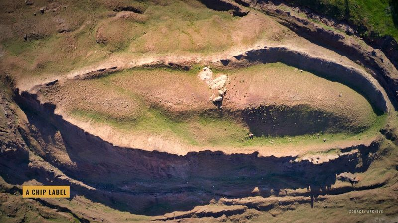
| Option | Default | Meaning |
|---|---|---|
| `img` | – | prepared picture (`img("name")`) |
| `move` | `in` | `in`, `out`, `left`, `right`, `up`, `down`, `push`, `none` |
| `focus` | `[0.5, 0.5]` | where the camera ends up |
| `zoom` | 1.14 | end zoom relative to a cover fit |
| `keys` | – | explicit camera `[[cx, cy, z], [cx, cy, z]]` |
| `fit` | cover | `contain` puts a non-16:9 picture over a blurred copy of itself ([preview](previews/paper/photo_contain.jpg)) |
| `dim`, `vignette` | – / 0.5 | darken for text on top |
```python
photo("cand_307", grade="bw", move="in", zoom=1.08, chip="1959", chip_at=0.3)
```

#### `depth`: depth pop
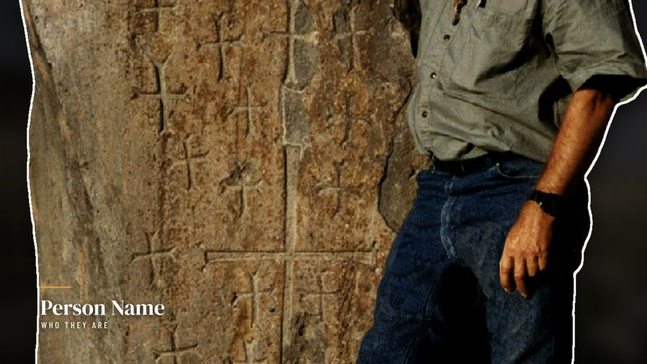
The subject (a rembg cut-out with a baked keyline) lifts off the picture, and the ground blurs and dims on the `hit`.
Options: `subject` (subject centre, fractions), `hit`, `pop` (0.07), `parallax` (26), `move`/`focus`/`zoom`/`keys`, `tint`.
```python
depth("cand_298", subject=[0.62, 0.45], hit=0.6, keys=[[0.55, 0.28, 1.0], [0.58, 0.31, 1.06]],
      lower=("David Fasold", "Marine salvage expert", "@David Fasold"))
```

#### `spotlight`: photo spotlight
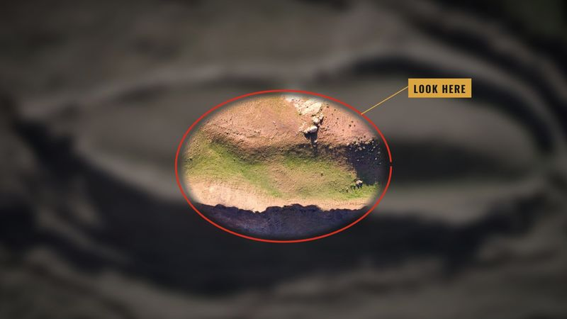
Everything but an ellipse dims and blurs, a red ring draws round it and a label hangs off a leader line.
Options: `center`, `radius` `[rx, ry]` (fractions), `label`, `hit`, `side` (`right`/`left`), `zoom`.
```python
spot("cand_074", center=[0.5, 0.62], radius=[0.12, 0.2], label="The greener grass", hit=0.3)
```

#### `tv`: a picture on an old television
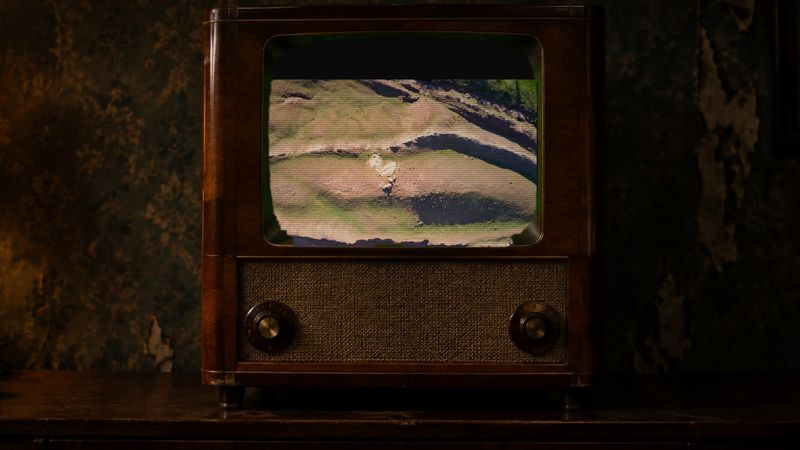
Options: `img`, `focus`, `from`/`to` (push-in zoom 1.0 → 1.28), `box` (screen rectangle), `set` (the TV image).

#### `card`: a found object
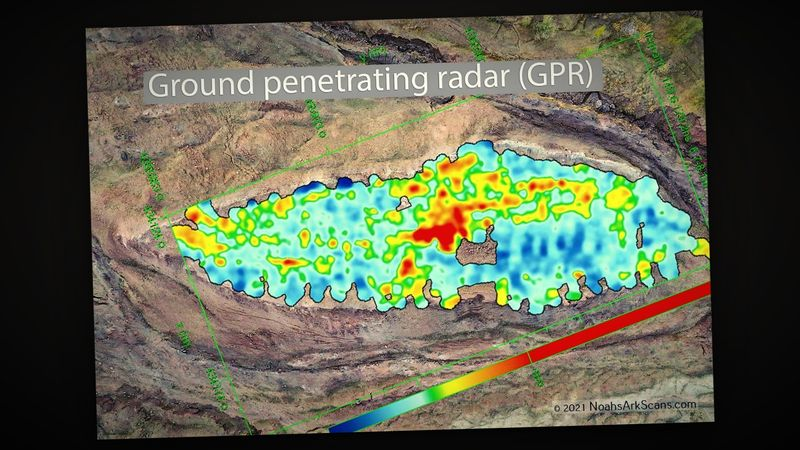
A post, clipping or document rises in tilted and the camera pushes to `focus`.
Options: `img`, `focus`, `zoom` (1.35), `height` (900), `width` (1500), `rot` (-3), `border`, `ground`.

#### `split`: side by side
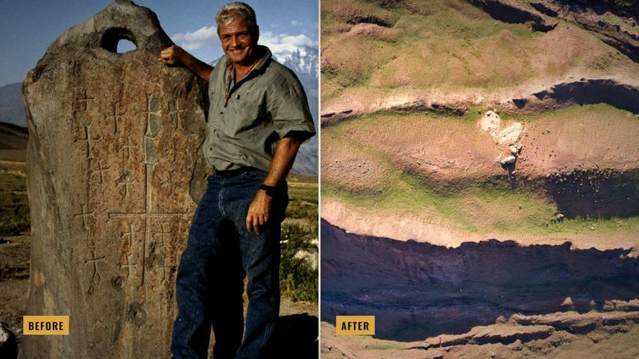
Options: `left`, `right` (prepared pictures), `leftLabel`, `rightLabel`, `leftFocus`, `rightFocus`.

### Paper and print

#### `collage`: the paper tabletop
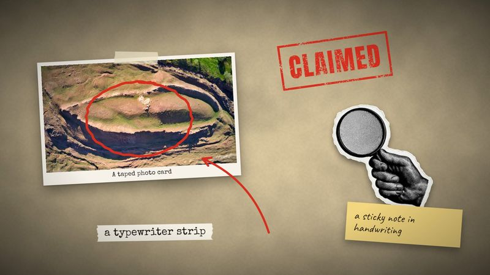 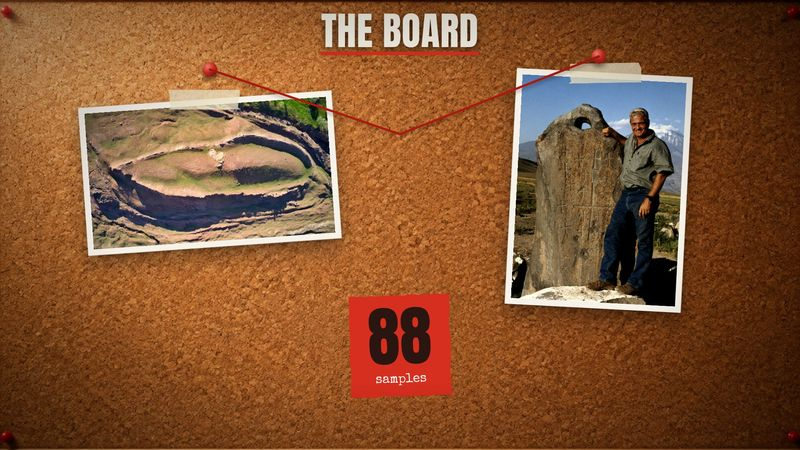
Options: `items` (see §7), `bg` (`paper`, `cork`, `map`, `dark`, `desk`), camera `z0`→`z1` (1.0→1.05) and `focus`, `vignette`.

#### `newspaper`

A full broadsheet page rises, the camera pushes onto the headline and a marker sweeps each line.
Options: `masthead`, `date`, `edition`, `price`, `headline` (`\n` between lines), `hsize`, `deck`, `body` (list of paragraphs), `img`, `caption`, `hit` (marker time), `zoom`, `ground`.
Write your own masthead. Don't copy a real publication's name or design.

#### `headlines`: torn strips on a wall
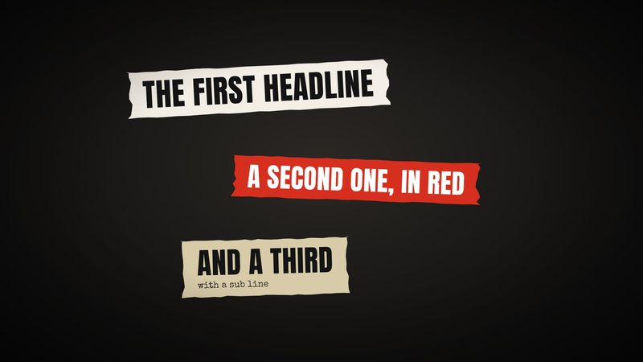
Items: `text`, `sub`, `x`, `y`, `rot`, `at`, `size`, `style` (`white`, `red`, `black`, `tan`), `from`.

#### `baskets`: three case folders
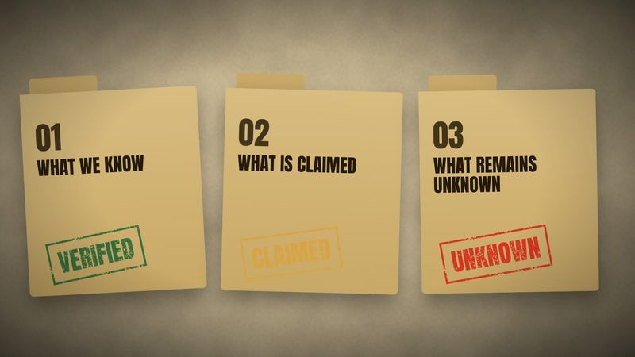
Options: `labels` (3), `stamps` (3), `reveal` + `at` + `gap` (deal them in), or `active` (0–2) + `focusAt` + `stampAt` (pull one forward).

#### `chapter`
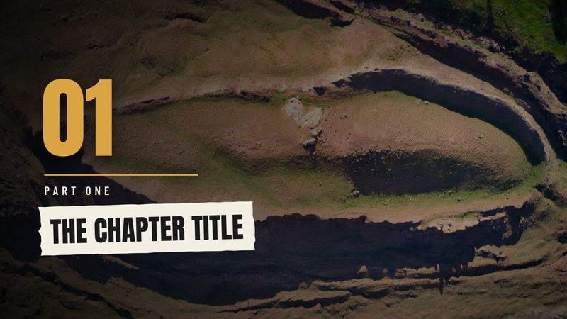
Options: `n`, `kicker`, `title`, `img`, `move`, `zoom`. A riser and an impact are added by the mix.

### Type and numbers

#### `title`
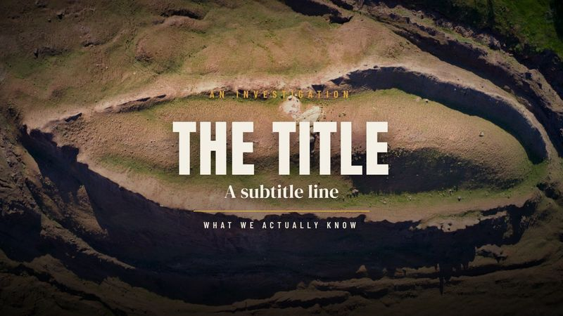
Options: `img`, `kicker`, `title`, `subtitle`, `tagline`.

#### `stat`: a number that counts up
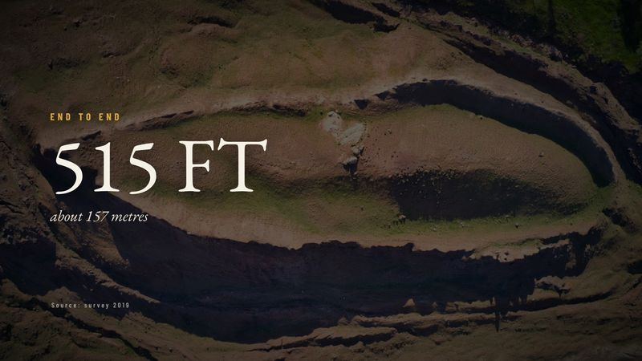
Options: `value` (any text with a number, like `"515 FT"`, `"+38%"` or `"5,000"`; the formatting is kept while counting), `kicker`, `note`, `source`, `img`, `dim`, `count` (False = no count), `countFor`, `align` (`center`), `y`, `size`, `font`, `noteAt`.

#### `quote`: revealed word by word
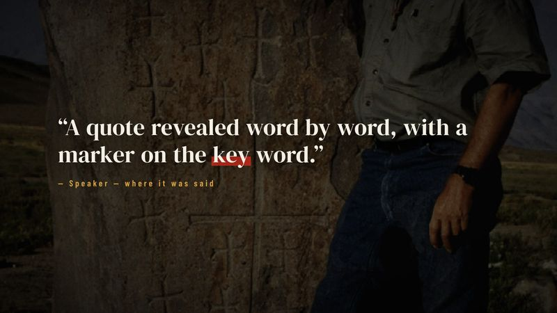
Options: `text`, `who`, `highlight` (words that get a red marker), `img`, `size`, `font`, `rate` (words/s).

#### `words`: kinetic type
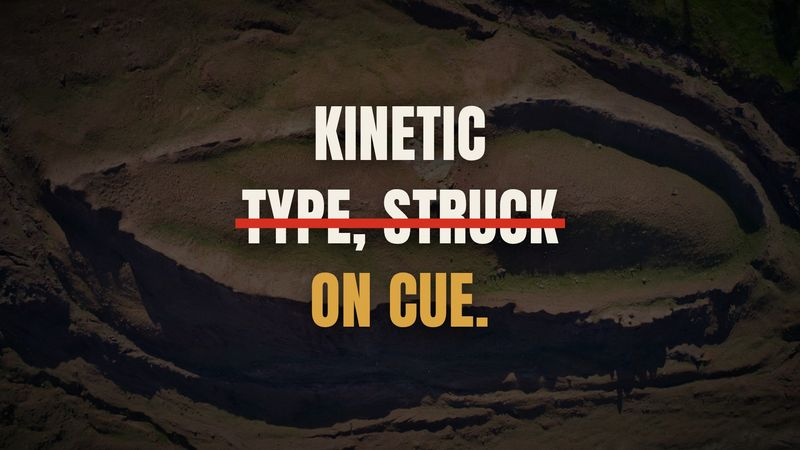
Items (`W_(text, y, at, size, …)`): `x`, `color`, `font`, `from` (`slam` default; `pop`, `drop`, `fade`, `up`, `down`, `left`, `right`), `strike` (time to strike through), `out`, `dimAt`, `rot`.
Scene options: `img`/`bg` (dimmed photo), `dim`, or `ground="dark"`.

#### `ledger`: handwriting on old paper
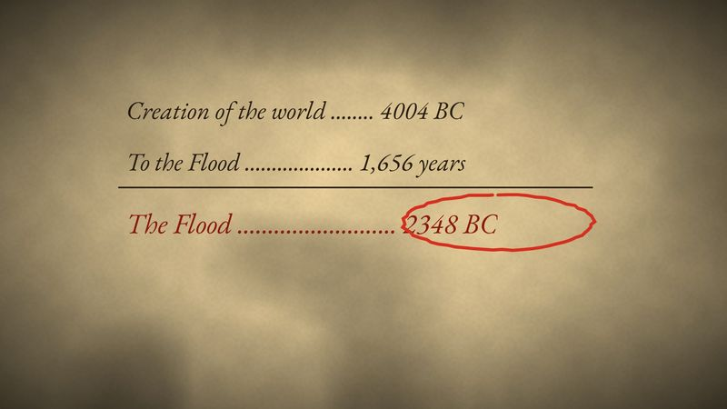
Lines: `text`, `at`, `y`, `x`, `size`, `font` (`GaramondI`), `color`, `d` (write duration).
Options: `ruleY`, `ruleAt`, `ruleW` (a line under the sum), `circle` `{x, y, rx, ry, at}`, `focus`.

#### `timeline`
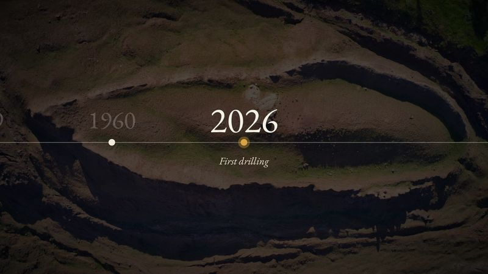
Options: `events` `[{year, label}]`, `stops` `[{i, at}]` (the camera moves to event `i` at `at`), `gap` (520 px), `ysize`, `img`, `dim`.

#### `measure`: bars compared
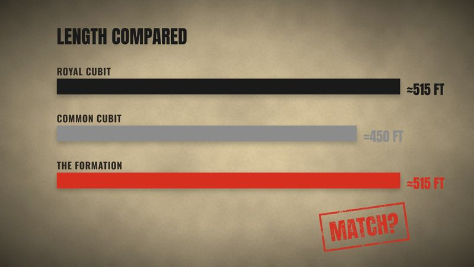
Options: `title`, `pxPerFt`, `rowGap`, `bars` `[{label, ft, value, at, color, grow}]`, `stamp` `{text, at, x, y}`.

#### `checklist`
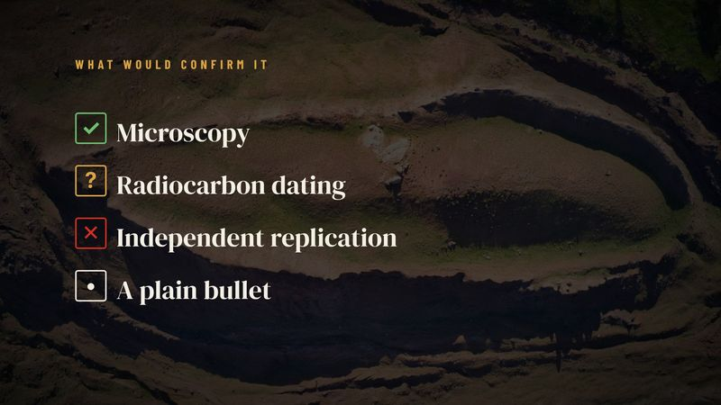
Options: `kicker`, `items` `[{text, at, mark}]` with `mark` = `yes`, `no`, `maybe` or `dot`. Also `size`, `gap`, `y0`, `img`, `focus` (index).

#### `geo`: geology cross-sections
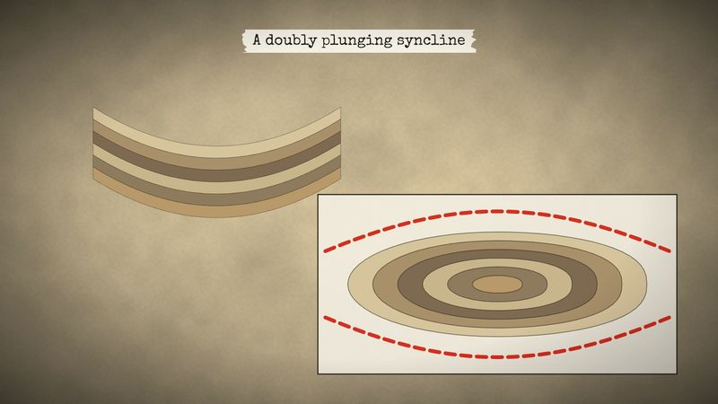 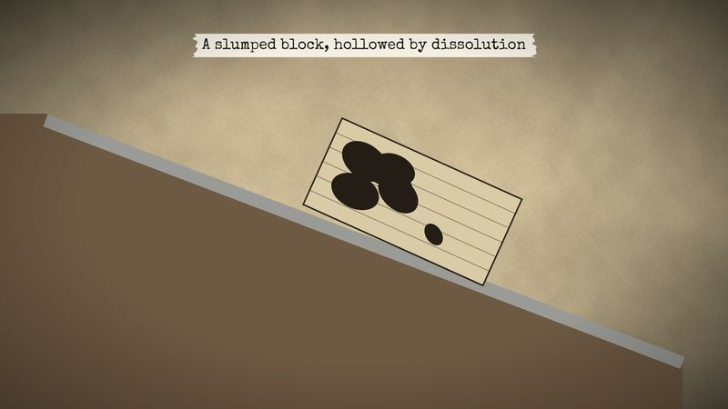
`variant="syncline"`: `beats` `{deposit, fold, plan, slide}`. Layers settle, fold into a trough, a plan view shows the lens, then a landslide scours it.
`variant="slump"`: `beats` `{deposit, fold, cav}`. Clay and limestone, the block slides, then dissolution hollows cavities.
`labels`: strips `{text, x, y, at, size, out, bg, color}`. Set a beat far in the past (−4) to start with it done, or far in the future (99) to skip it.

### Maps

#### `map`: globe to province
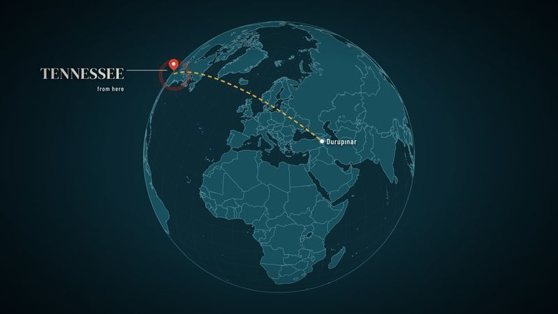 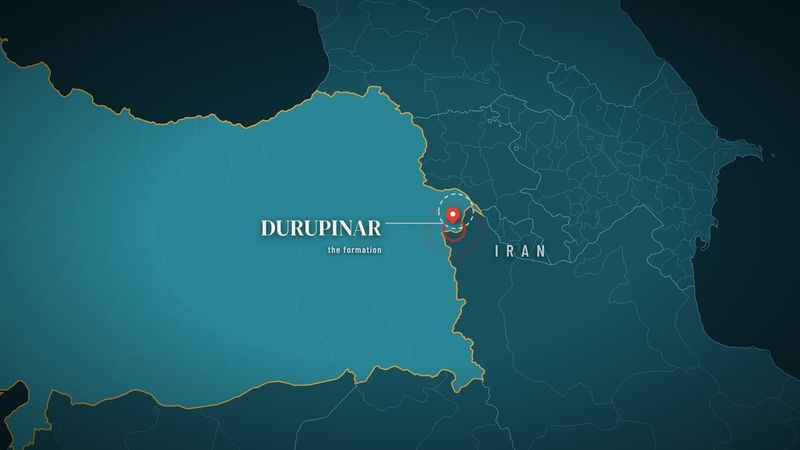
One continuous camera move on an orthographic globe (Natural Earth data from `kit/maps/`).

| Option | Meaning |
|---|---|
| `stops` | `[{at, lon, lat, scale, d}]`, where `scale` ≈ 430 is the whole globe, ≈ 3 000 a country and ≈ 40 000 a valley. `d` = travel time |
| `detail` | `geo_mid.json` (default) or `geo_hi.json` for close zooms |
| `highlight` | `[{id, at, out, fill}]` with ISO3 country ids (`TUR`) or admin-1 ids (`TUR-2307`) |
| `pins` | `[{lon, lat, label, sub, at, side, size, gap, out}]` pin with ring and leader label |
| `dots` | `[{lon, lat, label, at}]` small dot and label |
| `names` | `[{text, lon, lat, at, out, size}]` country/region names |
| `routes` | `[{from, to, at, d, dash, label, lx, ly}]` great-circle line drawing itself |
| `circles` | `[{lon, lat, km, at}]` dashed distance circle |
| `adminCountries` | which countries get province borders |

In Python write `from` as `**{"from": [lon, lat]}` (or `map_route()` in snippets).

### Forensic / lab (`scenes_lab.js`)

#### `filter`: observed / claimed / confirmed
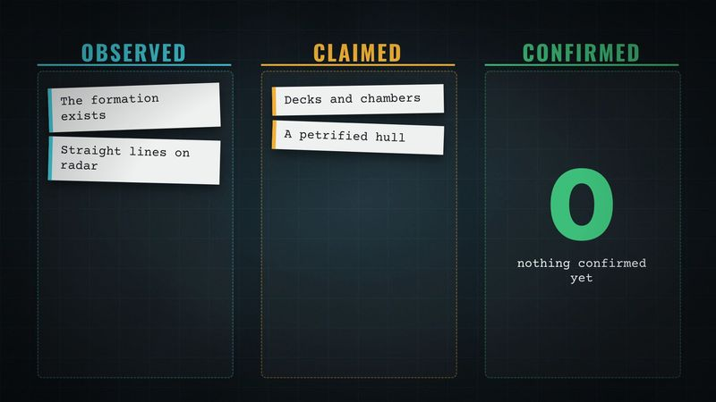
Options: `heads` (2 or 3 columns), `colors`, `items` `[{text, col, at, size}]`, `headAt` (per column), `focus` + `focusAt` (dim the others), `zeroAt` + `zeroText` + `zeroValue` + `zeroCol` (a big "0" in an empty column), `bg`.

#### `gauge`
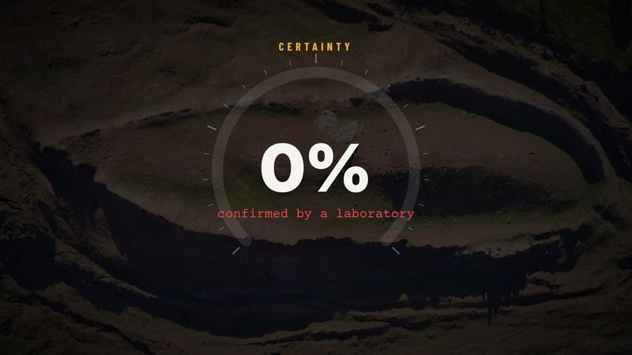
Options: `kicker`, `from`, `to`, `at`, `d`, `label`, then `to2`, `at2`, `d2`, `label2`, `color2` (drain to a second value). Also `img`, `dim`, `color`.

#### `network`: one source, many echoes
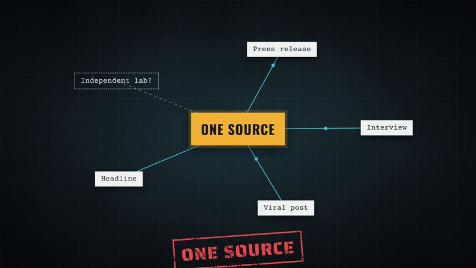
Options: `center`, `nodes` `[{label, at, r, dashed}]`, `rot`, `stamp` (a stamp item).

#### `valley`, `cells`, and the `scan` item
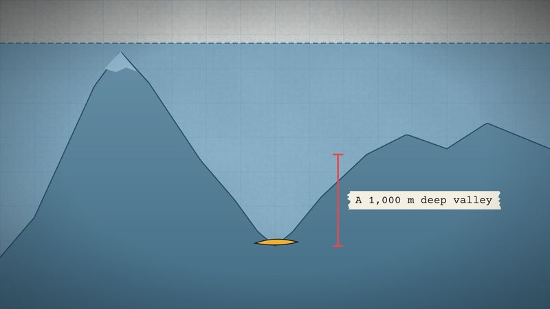 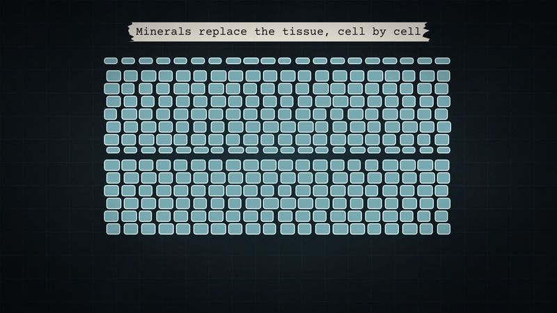 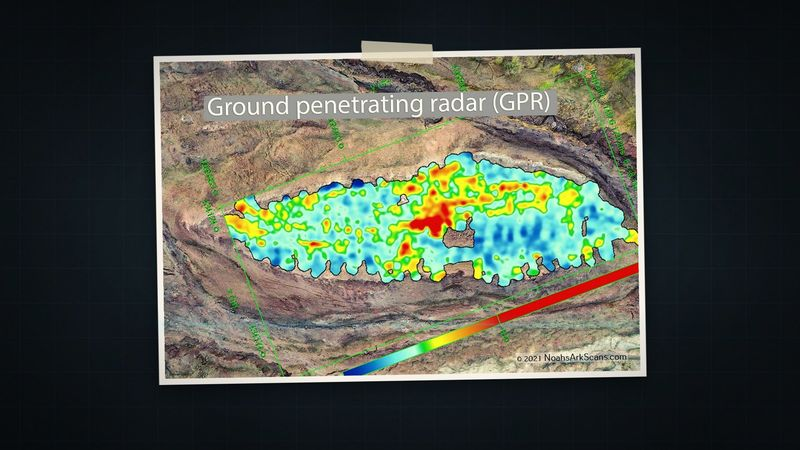
`valley`: `beats` `{draw, boat, measure, water}` and `labels`. `cells`: `beats` `{show, replace, dur}` and `labels` (petrification, cell by cell).
`scan` (collage item): `{k: "scan", x, y, w, h, at, period}` sweeps a glowing line over a region.

### Expedition / courtroom (`scenes_court.js`)

#### `scales`: the scales of justice
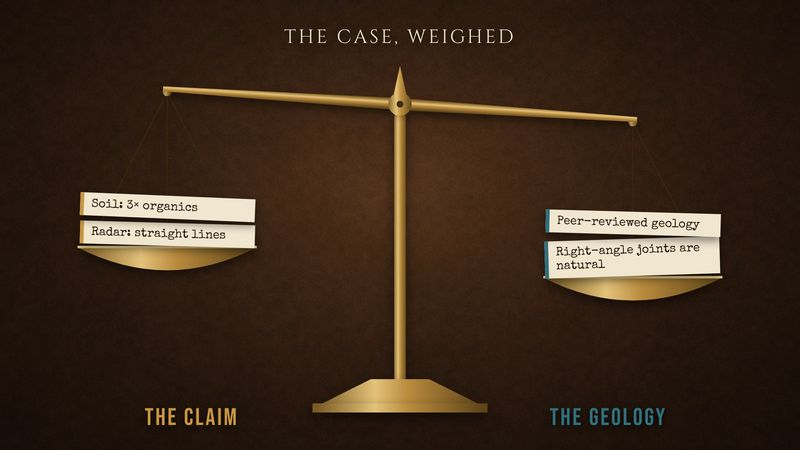
Evidence cards drop into the pans and the brass beam tips with a damped swing.
| Option | Meaning |
|---|---|
| `title` | text above the scales |
| `left`, `right` | `{title, color}` for the pans |
| `items` | `[{side: 0/1, text, at, w (weight), size}]` |
| `norm` | weight difference for a full tilt (3) |
| `tilts` | `[{at, v}]` drive the beam by hand (v −1 … 1) instead of by weight |
| `tilt0`, `maxDeg` | start tilt, maximum angle (11°) |
| `cardW`, `cardSize`, `half`, `drop`, `pivotY` | geometry |
```python
scales("THE CASE FOR THE PROSECUTION", [pan(0, "Scans", "@Scans"), pan(0, "Soil", "@soil"),
       pan(0, "A broken drill bit", "@a broken drill bit")], norm=5)
```

#### `scoreboard`: split-flap board
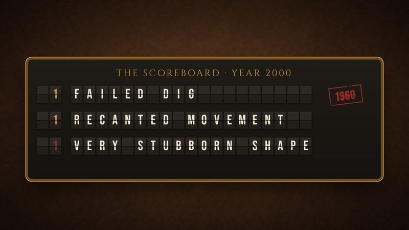
Rows clatter through letters and settle. Options: `title`, `rows` `[{n, text, at, color, stamp: {text, at, size, x, y}}]`, `cols` (text cells), `nw` (number cells), `cell` (cell width), `bg`.

#### `verdict`: two-column verdict sheet
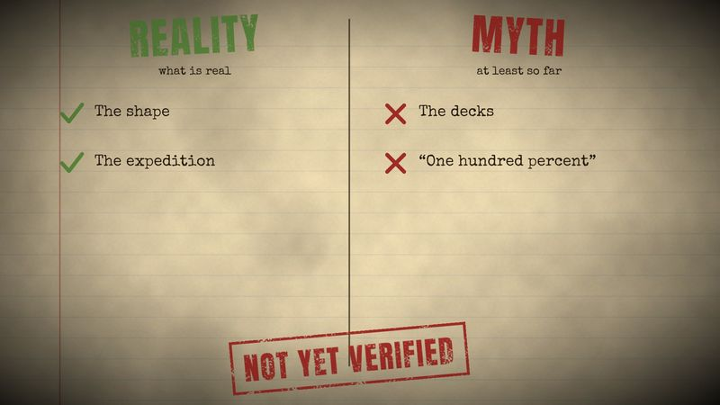
Options: `left`/`right` `{title, sub, color}`, `items` `[{side, text, at, mark (yes/no/dash), size}]`, `headAt`, `focus` + `focusAt`, `stamp`, `y0`, `gap`, `size`, `font`, `hsize`, `bg`.

#### `tag` (collage item): the evidence tag
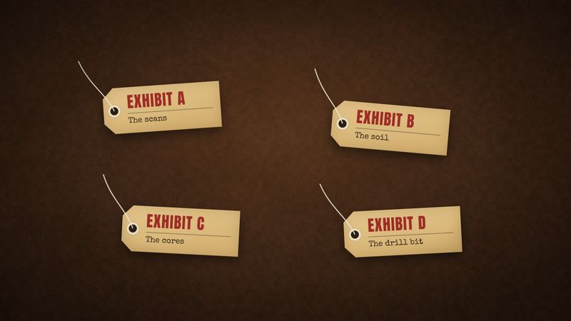
`{k: "tag", text, sub, x, y, at, rot, w, size, subSize, color, from, string}`. It drops in and swings to rest on its string.

### Broadcast / news desk (`scenes_news.js`)

#### `breaking`: the BREAKING NEWS opener
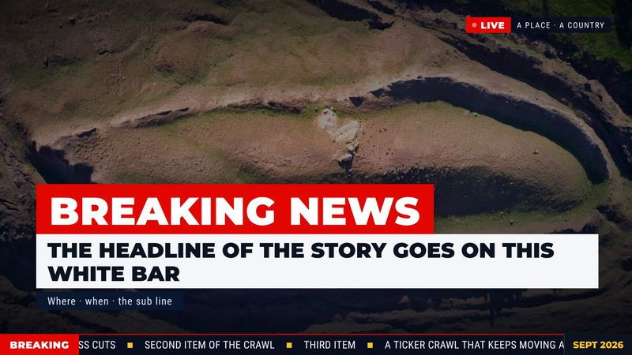
Options: `img`, `kicker` ("BREAKING NEWS"), `headline`, `sub`, `at` (slab), `headAt`, `subAt`, `ksize`, `hsize`, `y`.
Sound: glitch + news sting on the slab.

#### `segment`: the segment bumper
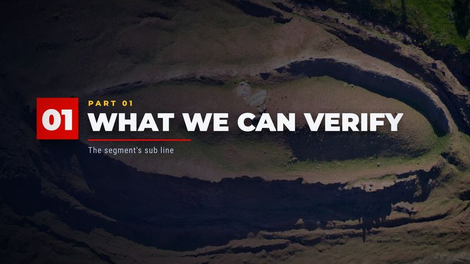
Red and navy bars sweep across and clear, a number box and the title land. Options: `n`, `kicker`, `title`, `sub`, `img`, `size`.

#### `borehole`: drilling cross-section
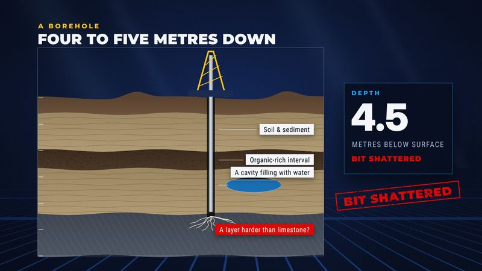
| Option | Meaning |
|---|---|
| `layers` | `[{from, to, kind}]` in metres, `kind` = `soil`, `sediment`, `organic`, `clay`, `hard` |
| `cavities` | `[{depth, x, w, h, at, water, fill}]` (a cavity, optionally filling with water from `fill`) |
| `beats` | `{draw, drill, hit}`: the drill descends from `drill` to `hit` |
| `hitDepth`, `maxDepth` | where the bit stops / the depth of the panel (4.5 / 6 m) |
| `shatter` | False = the drill just reaches `toDepth` (coring) instead of shattering |
| `labels` | `[{text, depth, at, bg, color, dy, x, line}]` callouts on leader lines |
| `title`, `kicker`, `statusText`, `hitText`, `unit`, `stamp`, `bot`, `top`, `rigX` | text and geometry (`bot=940` keeps it above a ticker) |

#### `factcheck`: claim and rating meter
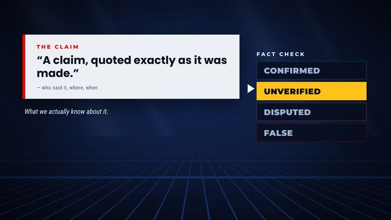
Options: `claim`, `source`, `rating`, `ratingAt`, `scale` (default CONFIRMED / UNVERIFIED / DISPUTED / FALSE),
`colors`, `meterTitle`, `note`, `noteAt`, `kicker`, `size`. The needle scans, then settles on the rating.
Custom scales work: `scale=["MAN-MADE", "UNCLEAR", "NATURAL"]`.

#### `echo`: many headlines, one source
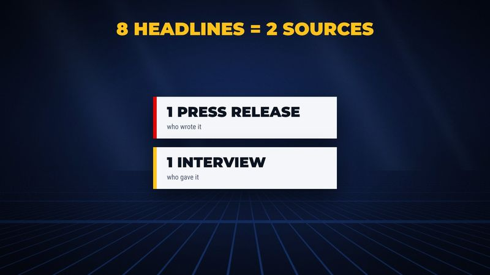
Options: `headlines` `[{text, tag, at}]`, `gap`, `cols`, `collapseAt`, `sources` `[{title, sub}]`, `sourceGap`, `unit`, `result`.

#### `columns`: OBSERVED | CLAIMED
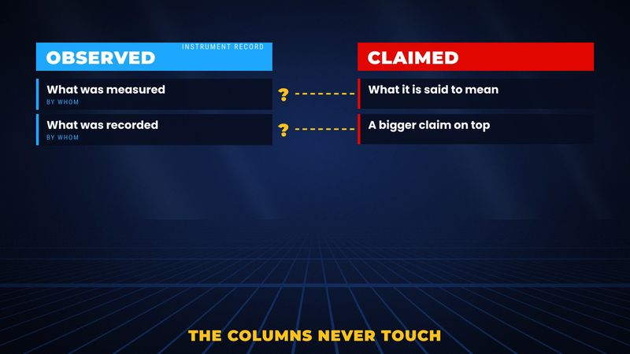
Options: `left`/`right` `{title, sub, color}`, `items` `[{side, text, tag, at, size}]`, `gap`, `headAt`,
`gapAt` + `gapText` (the arrows from the claims reach across and stop short: "THE COLUMNS NEVER TOUCH").

#### `videowall`
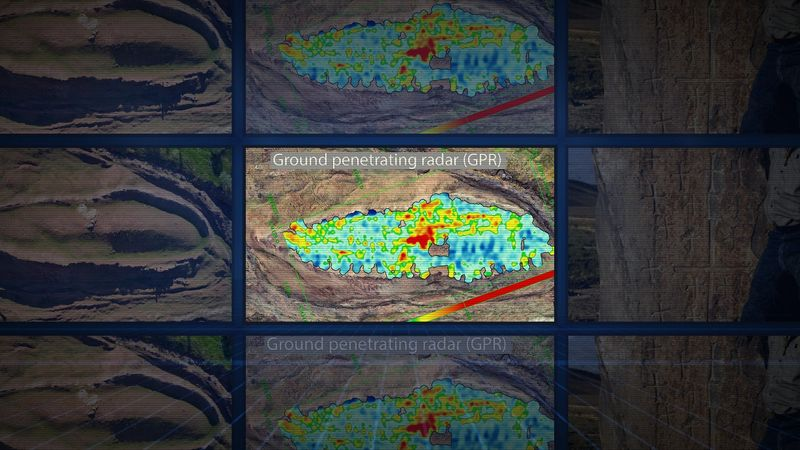
Options: `imgs` (up to 9, repeated), `focus` (0–8), `pushAt`, `pushFor`.

#### `newslist`: numbered rows with status pills
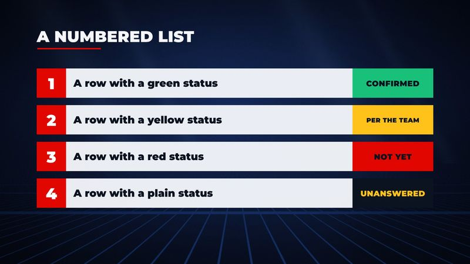
Options: `title`, `items` `[{text, sub, n, at, status, statusColor, statusAt, size}]`, `y0`, `gap`, `rowH`, `size`, `img`.

### Calm documentary (`scenes_doc.js`)

#### `doctitle`: chapter heading
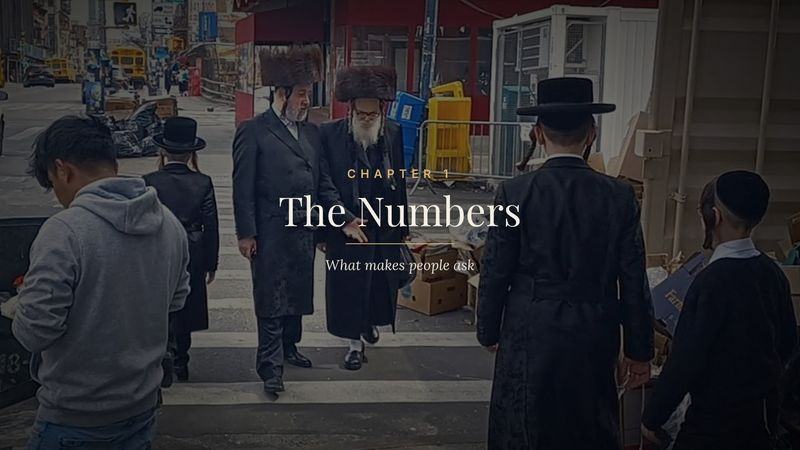
Options: `kicker` ("Chapter 3"), `title`, `sub`, `img`, `dim`, `size`, `move`, `zoom`.

#### `textcard`: a line or two over a darkened photo
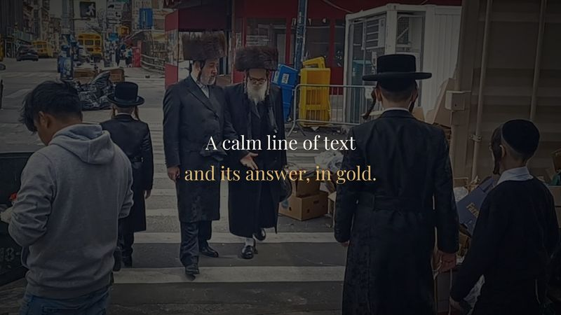
Options: `lines` `[{text, at, color, size, font}]`, `img`, `dim`, `align`, `gap`, `dy`.

#### `bars`: a calm horizontal bar chart
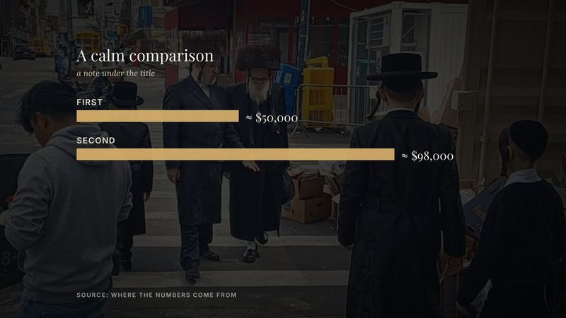
Options: `title`, `note`, `bars` `[{label, value, text, at, color}]`, `max`, `maxW`, `y0`, `gap`, `source`, `img`, `dim`.

#### `ledgerlist`: a household ledger
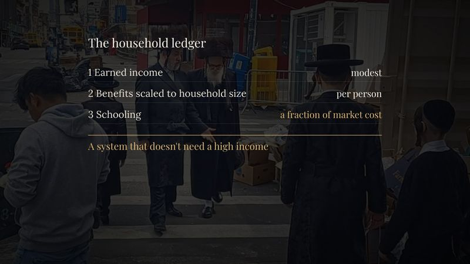
Options: `title`, `items` `[{label, value, at, color}]` (negative `at` = already written), `total` `{label, value, at}`,
`x`, `w`, `y0`, `gap`, `size`, `img`, `dim`. Show it again with one more item each chapter.

#### `sizechart`: a threshold that rises with household size
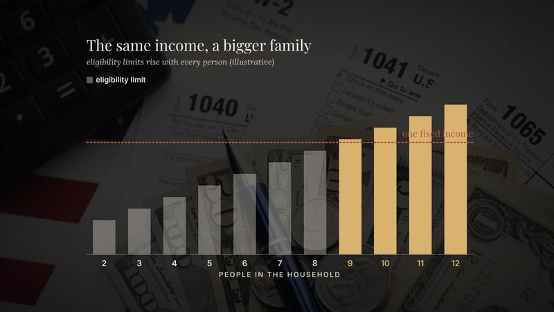
Options: `title`, `note`, `sizes` (default 2–12), `values` or `base` + `step`, `income` + `incomeLabel` + `incomeAt`
(a fixed dashed line; columns above it turn gold), `barLabel`, `xlabel`, `at`, `per`, `source`. Mark it
"illustrative" unless you give real values.

Overlays: `dict(type="place", text="Williamsburg, Brooklyn", sub="…", at=0.6)` and
`dict(type="doclower", name="Name", role="Role", at=0.6)`.

### Clips

```python
clip(388, zoom=1.03)                                  # catalog shot 388, 3 % crop-in
clip(24, then=(250, 396), chip="2024 · 88 samples")    # too short? join more shots
clip(504, skip=18.0, grade="doc")                     # start 18 s into the shot
```
Clips whose overlays include `ticker`, `bug` or `newslower` get them as a moving alpha layer (rendered
frame by frame, then composited), so a crawl keeps moving over footage. Other overlays are one still PNG.

Clips are cut by FFmpeg from `footage/source_video/`, slowed down to at most 0.5× when the words
need more time, graded, cropped in by `zoom` and overlaid with the scene's overlays (rendered
transparent by the browser). `plan` warns when a clip covers less than half its time.

---

## 7. Collage items

| `k` | Keys | Enters with |
|---|---|---|
| `photo` | `img`, `x`, `y`, `w`, `h`, `rot`, `caption`, `pad`, `tape` (False = no tape) | slides in from the left |
| `cut` | `img` (from `cutout()`), `x`, `y`, `h` | rises from below |
| `stamp` | `text`, `size`, `color` (grunge-masked rubber stamp) | slams |
| `strip` | `text`, `size`, `font`, `bg`, `color`, `cps` (typing speed), `type: False` (no typing) | fades, then types |
| `title` | `text`, `size`, `font`, `color`, `align`, `ls`, `shadow`, `underline` | fades |
| `note` | `text`, `w`, `size`, `bg` (sticky note in Caveat) | drops |
| `stat` | `value`, `label`, `bg`, `color`, `size`, `count`, `countFor` | pops |
| `pin` | `x`, `y` | drops |
| `string` | `pts` `[[x, y], …]`, `color`, `width`, `d` | draws |
| `circle` | `x`, `y`, `rx`, `ry`, `color`, `width`, `d` | draws |
| `arrow` | `from`, `to`, `bend`, `color`, `d` | draws |
| `text` | `text`, `w`, `size`, `font`, `color`, `align`, `lh` (`\n` breaks lines) | fades |
| `tag` | see above | drops and swings |
| `scan` | see above | sweeps |

Text items (`title`, `text`) default to ink colour. On the dark grounds (`cork` in the forensic and expedition themes, `dark`) give them `color="#F4EFE4"` and a `shadow`.

Every item takes `at` (when it arrives), `rot`, `out` (when it leaves), and `from` to change the
entrance: `left`, `right`, `up`, `down`, `drop`, `pop`, `slam`, `fade`.

## 8. Overlays (any scene)

```python
overlays=[dict(type="chip", text="1959 · NATO mapping mission", at=0.4),
          dict(type="lower", name="Andrew Jones", role="Noah's Ark Scans", at="@Andrew Jones"),
          dict(type="caption", text="a line under the picture", at=0.5, out=4.0),
          dict(type="source", text="Source: NASA", at=0.8),
          dict(type="flash", at="@dynamite"),              # white flash + an impact sound
          dict(type="fadein", d=1.0), dict(type="fadeout", d=1.6)]
```
The `photo`, `clip` and `depth` helpers take `chip=`, `chip_at=`, `lower=(name, role, at)` directly.

Broadcast overlays (`scenes_news.js`):
```python
dict(type="ticker", label="BREAKING", clock="SEPT 2026", items=["first item", "second item"], speed=150, intro=0.4)
dict(type="bug", text="LIVE", place="Durupınar · Turkey", intro=0.2)
dict(type="newslower", kicker="ON THE GROUND", text="DURUPINAR FORMATION", sub="29 km from Mount Ararat", at=0.5)
```
Don't copy a real channel's name, logo or colours for the bug. Keep it generic ("LIVE", a place, a date).

---

## 9. Sound design and music

### Automatic SFX (`mix.spot`)
Every sound is synthesised (no library needed) and placed from the scene specs:

| Scene / item | Sound |
|---|---|
| cut into any graphic scene | whoosh (short for words / stat / quote) |
| `chapter` | riser before, impact on, whoosh after |
| `words` | stamp for big words, pop for small; zip on a strike-through |
| `stat` / collage `stat` | whoosh + counter roll |
| collage `photo` / `cut` / `note` / `tag` | paper |
| `stamp`, `headlines` | stamp hit |
| `strip` | typewriter (length follows the text) |
| `string` / `arrow` / `circle` | zip |
| `map` | long whoosh, ping per pin, zip per route |
| `ledger` / `verdict` items | pen |
| `spotlight` | soft boom on the hit |
| `depth` | whoosh on the hit |
| `scales` | paper + brass clank per card |
| `scoreboard` | split-flap clatter per row, stamp |
| `filter` / `network` | paper per card / pop per node |
| `tv` / `card` / `newspaper` | TV static / paper + whoosh |
| `breaking` / `segment` | glitch + news sting / whoosh + sting |
| `borehole` | drilling (percussion + rumble) until the hit, the shatter, pops for callouts |
| `factcheck` | ticking scan, stamp on the rating |
| `echo` | pop per headline, long whoosh + impact on the collapse |
| `columns` / `newslist` / `videowall` | whoosh per row, zip on the gap / stamp per status / TV static + whoosh |
| overlay `flash` / `chip` / `lower` / `newslower` | impact / faint whoosh |

Cues that start before their scene (negative `at`) stay silent. To add a sound, write a synth
function in `mix.py`, add it to `bank()`, and spot it in `spot()`.

### Music
One bed per act, crossfaded 2.5 s, looped if short:
```python
MUSIC = [dict(at=None, track="09_Thunder_Dreams_Dark_Drone.mp3", db=0),
         dict(at="Let's begin with the hunt itself", track="02_Leaving_Home.mp3", db=0, lead=-1.0)]
```
`at` = the cue whose scene starts the bed, `lead` = seconds earlier, `db` = trim.
Change the palette per video, and don't reuse the previous video's opening track.

### Levels: keep the music quiet
`edl.setup(music_floor_db, music_duck_db, sfx_gain)`:

| Setting | Loud (video 1) | **Quiet (videos 2–3, recommended)** |
|---|---|---|
| `music_floor_db` (in pauses) | −12.5 | **−21** |
| `music_duck_db` (extra dip under the voice) | −9 | **−10** |
| `sfx_gain` | 0.7 | **0.55** |

With the quiet setting the bed sits about 21 dB under the narrator in pauses and about 31 dB under it
while the narrator speaks. The mix is then normalised to **−14 LUFS**, true peak −1.2 dB (YouTube's reference).

---

## 10. Delivery: size under 1 GB without visible loss

Scenes are encoded with libx264 `veryfast`, CRF 18, 30 fps, and audio is AAC 256 kb/s. **Film grain is
what drives the file size**, because noise can't be compressed:

| Video | Length | grain | Bitrate | Size |
|---|---|---|---|---|
| Video 1 | 19:24 | 5 | 23.6 Mb/s | 3.4 GB (re-encoded to 9.7 Mb/s → 1.4 GB) |
| Video 2 | 26:26 | 2 | 4.5 Mb/s | 0.9 GB |
| Video 3 | 13:47 | 2 | 4.8 Mb/s | 0.5 GB |

Keep `grain` at 2–3 for anything long. If a master is still too big, re-encode only the video:
```bash
ffmpeg -i master.mp4 -c:v libx264 -preset slow -crf 20 -pix_fmt yuv420p -c:a copy -movflags +faststart out.mp4
```

Temporary download link (gofile), then compare checksums:
```bash
curl -F "file=@out/My_Video.mp4" https://upload.gofile.io/uploadfile     # prints the download page
md5sum out/My_Video.mp4                                                   # compare after downloading
```

---

## 11. QA checklist (before `render`)

- [ ] `plan`: no scene under 0.3 s, no clip warnings, clips at about 20 %.
- [ ] `stills`: read every frame. Check text isn't cut off, labels don't overlap, the right picture is in the right place, and the same picture doesn't appear in consecutive scenes.
- [ ] Pictures with black or white borders get a `crop=`.
- [ ] Anything the narrator says is a claim is labelled as one on screen.
- [ ] No fake mastheads or logos of real publications, and no AI or stock images when the brief says so.
- [ ] Re-render single scenes after fixes: `render s012 s013`.
- [ ] After `final`: watch the first minute and every chapter change. Check the size, then upload.

Run `gallery.py` after any engine change. It renders every scene type in every theme:
```bash
python docu/templates/gallery.py --kit media/kit --photo a.jpg --portrait person.jpg --scan scan.jpg --object object.png
```

---

## 12. Troubleshooting

| Symptom | Fix |
|---|---|
| Playwright can't find a browser | set `DOCU_CHROME=/path/to/chromium` (the default is the headless_shell used in this project's container) |
| Map scene is blank | the page loads `kit/maps/*.json` by XHR, so check the kit path. `fetch()` doesn't work on file:// |
| A glyph shows as a box (≠, ✓ in some fonts) | write it in words, or use a font that has it |
| Overlay on a clip is a black box | the overlay page must be transparent (`render_overlay_png` sets this). Don't give overlays a background |
| `scene N has duration 0.0` | two cues resolve to the same word. Use a longer or later phrase |
| Music too loud | lower `music_floor_db` (−21) and `music_duck_db` (−10) |
| File too big | lower `grain`, or re-encode (§10) |
| rembg cut-out is poor | crop tighter (`crop=`), or supply your own PNG cut-out |

## 13. Writing a new scene type

```js
/* scenes_mine.js - add a <script> line for it in engine.html */
SCENES.mything = async (s, root) => {
  paperGround(root, s.bg || "paper");                    // or darkPhoto(root, s, 0.7)
  const box = el("div", "abs", root, { left: "200px", top: "300px", font: "90px 'Anton'", color: PAL.ink }, esc(s.text));
  vignette(root, 0.4);
  return t => {                                          // draw frame t - pure function of t
    const a = eOut(seg(t, s.at || 0, 0.5));
    setO(box, a); setT(box, 0, (1 - a) * 40);
  };
};
```
Rules: nothing may depend on real time or `Math.random`, so use `rng(seed)`. Wait for pictures
through `pic()`. Use `setT`/`setO`/`css` (they skip unchanged values). Then add its sounds in
`mix.spot()` and a spec in `gallery.py`.
